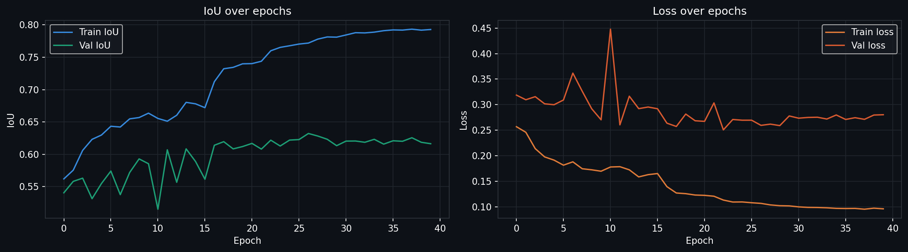
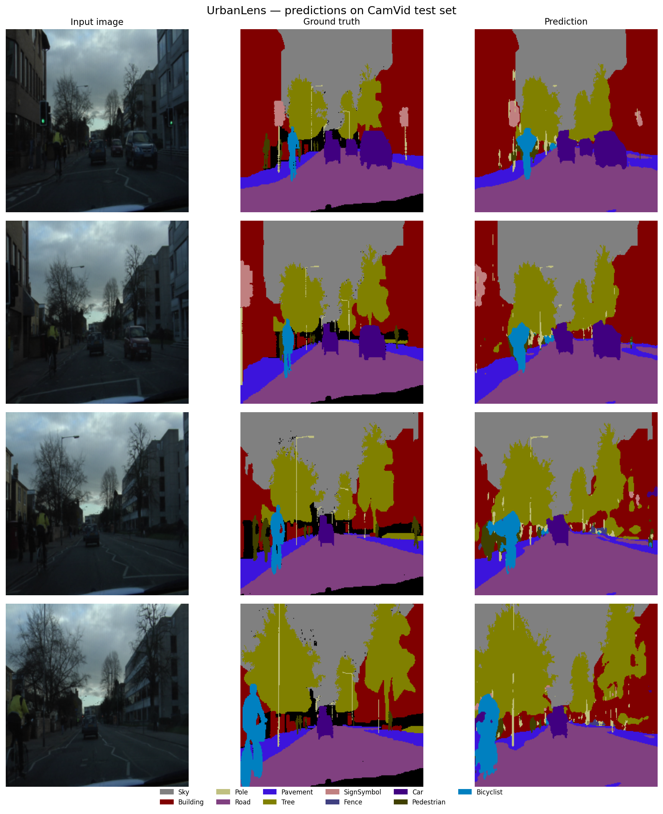

# UrbanLens

Pixel-wise semantic segmentation of urban road scenes, trained on the CamVid dataset.
Built from scratch in PyTorch - covers the full ML pipeline from data loading to evaluation.

## Training curves



## Predictions vs ground truth



## Results

| Metric | Score |
|--------|-------|
| Mean IoU (test set) | 47.8% |
| Test loss | 0.4254 |
| Best val IoU | 62.8% |
| Final train IoU | 79.3% |

## Per-class IoU

| Class | IoU | Notes |
|-------|-----|-------|
| Sky | 91.4% | Large uniform region |
| Road | 90.7% | Large uniform region |
| Building | 74.9% | Strong |
| Pavement | 71.0% | Strong |
| Tree | 66.6% | Strong |
| Car | 63.3% | Moderate |
| SignSymbol | 19.3% | Rare - class imbalance |
| Pedestrian | 17.2% | Rare - class imbalance |
| Pole | 12.8% | Thin structure - hard geometry |
| Fence | 9.9% | Rare and thin - class imbalance |
| Bicyclist | 8.7% | Rarest class - class imbalance |

Large classes (Sky, Road) score 90%+ IoU. Rare and thin classes (Bicyclist, Fence, Pole) score under 15% due to class imbalance - addressable via weighted loss or focal loss.

## Architecture

U-Net with 4 encoder/decoder levels and a bottleneck (~31M parameters).

- **Encoder**: 4x DoubleConv blocks (3×3 conv → BatchNorm → ReLU × 2) + MaxPool
- **Bottleneck**: DoubleConv at 1024 channels
- **Decoder**: ConvTranspose2d upsampling + skip connections + DoubleConv
- **Output**: 1×1 conv → 12-channel logits (11 classes + 1 ignore)

## Dataset

[CamVid](http://mi.eng.cam.ac.uk/research/projects/VideoRec/CamVid/) - Cambridge-driving Labeled Video Database.

- 367 train / 101 val / 233 test images
- 11 semantic classes: Sky, Building, Pole, Road, Pavement, Tree, SignSymbol, Fence, Car, Pedestrian, Bicyclist
- Images resized to 256×256, normalised with ImageNet mean/std

## Training details

| Setting | Value |
|---------|-------|
| Loss | CrossEntropyLoss (ignore_index=11) |
| Optimiser | Adam, lr=1e-3 |
| Scheduler | ReduceLROnPlateau (patience=3, factor=0.5) |
| Epochs | 40 |
| Batch size | 8 |
| Hardware | Google Colab T4 GPU |

## Project Structure

```text
urban-lens/
├── src/
│   ├── dataset.py      # CamVidDataset: loading, resizing, normalization
│   ├── model.py        # U-Net architecture and DoubleConv blocks
│   ├── train.py        # Training loop with checkpointing
│   ├── evaluate.py     # IoU metric and per-class evaluation
│   └── visualize.py    # Prediction visualization with color-coded masks
├── outputs/
│   ├── training_curves.png
│   └── predictions.png
├── data/
│   └── CamVid/
└── README.md
```

You can download the dataset from the SegNet Tutorial repository:
https://github.com/alexgkendall/SegNet-Tutorial

## References
- Ronneberger et al., [U-Net: Convolutional Networks for Biomedical Image Segmentation](https://arxiv.org/abs/1505.04597) (2015)
- Brostow et al., Semantic Object Classes in Video: A High-Definition Ground Truth Database (2009)
